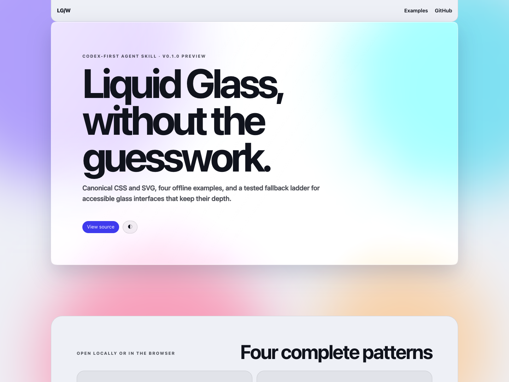

# Liquid Glass Web

[中文说明](README.zh-CN.md) · [Live demo](https://voyhuang.github.io/liquid-glass-web/) · [Examples](#examples) · [Install](#install-for-codex)

A Codex-first [Agent Skill](https://agentskills.io/specification) for building
faithful, accessible Liquid Glass interfaces on the web. Its structure follows
the [OpenAI Skills guide](https://developers.openai.com/plugins/build/skills)
while intentionally remaining a standalone skill. It packages one pinned CSS
material, one runtime SVG/JavaScript snippet, implementation guidance, and four
self-contained examples.

The material provides translucent tint, backdrop frost, specular rim lighting,
a cursor-tracked spotlight, and Chromium-only displacement refraction. Safari,
Firefox, accessibility preferences, forced colors, and print receive explicit
fallbacks instead of a broken approximation.

> Preview release: `v0.1.0`. This is a standalone skill, not a Codex Plugin and
> not an npm package.

## Preview

[Open the live GitHub Pages demo](https://voyhuang.github.io/liquid-glass-web/).
The static landing page links directly to the four self-contained HTML examples
inside the installable skill.



## What is included

```text
skills/liquid-glass-web/
├── SKILL.md
├── agents/openai.yaml
├── assets/
│   ├── glass.css
│   └── refraction-snippet.html
└── references/
    ├── components.md
    ├── example-quick-start.html
    ├── example-components.html
    ├── example-music-player.html
    └── example-resume.html
```

The skill directory is self-contained and can be installed directly from its
GitHub subpath. The repository root contains only documentation and the static
GitHub Pages example index; there is no package or build step.

## Install for Codex

Ask Codex to install the tagged release:

```text
Use $skill-installer to install https://github.com/voyhuang/liquid-glass-web/tree/v0.1.0/skills/liquid-glass-web
```

To follow `main` instead, replace `v0.1.0` with `main`. Restart Codex if the new
skill is not immediately listed. Then invoke it explicitly:

```text
Use $liquid-glass-web to apply the canonical Liquid Glass material to this web interface.
```

The explicit invocation is useful when you need exact fidelity. The skill's
description also allows Codex to select it for requests involving liquid glass,
glassmorphism, frosted panels, or related debugging.

## Manual install

```sh
git clone --depth 1 --branch v0.1.0 https://github.com/voyhuang/liquid-glass-web.git
mkdir -p ~/.codex/skills
cp -R liquid-glass-web/skills/liquid-glass-web ~/.codex/skills/liquid-glass-web
```

Verify the installed structure with Codex's local validator if it is available:

```sh
python3 ~/.codex/skills/.system/skill-creator/scripts/quick_validate.py ~/.codex/skills/liquid-glass-web
```

This repository never overwrites or replaces an existing local installation.
Review the destination before copying if that folder already exists.

## Quick use

For a self-contained HTML page:

1. Copy all of [`glass.css`](skills/liquid-glass-web/assets/glass.css) into a
   `<style>` element.
2. Add `.lg`, optionally with a weight class, to a small number of floating
   surfaces.
3. Copy all of
   [`refraction-snippet.html`](skills/liquid-glass-web/assets/refraction-snippet.html)
   near the end of `<body>`.
4. Put page-specific CSS after the canonical stylesheet. Put application scripts
   after the canonical snippet, then close `</body>`.

```html
<article class="lg lg--thick lg-materialize">
  <h1>One clear surface</h1>
  <p>Controls inside glass use unblurred chips.</p>
  <button class="lg-chip lg-cta" type="button">Continue</button>
</article>
```

Use [`example-quick-start.html`](skills/liquid-glass-web/references/example-quick-start.html)
as the smallest complete reference. Do not rebuild the material declarations
from memory: both canonical assets are deliberately pinned.

| Canonical asset | SHA-256 |
|---|---|
| `glass.css` | `98e07bd1b012bb0b020e50fb423c0e2d65190a9b6263f8e851ccbfafd0a7bdb4` |
| `refraction-snippet.html` | `7c33def72b231ecb1d009fdf4ef937fa7d637abf0a6e72dcf284260ee46c0351` |

## Public classes

These class names are the stable public interface for `v0.1.0`.

| Class | Purpose |
|---|---|
| `.lg` | Base pane and three-layer material stack |
| `.lg--thick` | Large cards and dialogs; heavier frost and shadow |
| `.lg--thin` | Navigation, docks, and compact floating controls |
| `.lg-materialize` | Tuned entrance; stagger with `--enter-delay` |
| `.lg-chip` | Unblurred chip or button for use inside glass |
| `.lg-cta` | Accent-filled `.lg-chip` variant |
| `.lg-backdrop` | Optional animated color field behind the glass |

Avoid glass-on-glass. A control inside `.lg` should use `.lg-chip`, not another
`.lg`. Keep each viewport to five glass panes or fewer. `.lg` alone is the
supported medium-weight surface; `.lg--thick` and `.lg--thin` are optional
hierarchy modifiers.

## Design tokens

Override tokens after the canonical stylesheet; do not edit the material layer
rules. Defaults differ by light/dark theme where noted.

| Token | Default / role |
|---|---|
| `--lg-blur` | `16px`; overridden to `24px` thick / `12px` thin |
| `--lg-sat`, `--lg-bright` | `1.8`, `1.08`; color recovery behind blur |
| `--lg-radius` | `26px`; use `999px` for pills |
| `--bg`, `--ink`, `--ink-dim`, `--hairline` | Page, primary text, secondary text, separators |
| `--lg-tint`, `--lg-tint-a` | Theme tint channels and alpha |
| `--lg-border`, `--lg-spec` | Outer hairline and specular rim colors |
| `--lg-shadow`, `--lg-shadow-sm` | Large-surface and floating-chrome depth |
| `--sheen-a`, `--spot-max` | Diagonal sheen and cursor spotlight strength |
| `--chip-bg`, `--chip-border` | Unblurred control treatment |
| `--accent`, `--accent-ink` | CTA, focus, and status colors |
| `--solid` | Near-opaque accessibility/print fallback surface |
| `--hue-a` … `--hue-d` | Optional backdrop colors |
| `--blob-opacity` | Optional backdrop intensity |
| `--enter-delay` | Per-pane materialize delay; default `0s` |

`--mx`, `--my`, and `--spot-a` are runtime spotlight state, not design inputs.
The SVG displacement scales `38 / 45 / 52` are pinned material parameters.

## Examples

Every example is a single HTML file that opens offline. Each embeds the exact
canonical stylesheet and snippet, and each remains within the five-pane budget.

| Example | Demonstrates | Live |
|---|---|---|
| [Quick Start](skills/liquid-glass-web/references/example-quick-start.html) | Minimal nav, hero, theme, and fallbacks | [Open](https://voyhuang.github.io/liquid-glass-web/skills/liquid-glass-web/references/example-quick-start.html) |
| [Component Gallery](skills/liquid-glass-web/references/example-components.html) | Nav, card, chips, standalone CTA, dialog | [Open](https://voyhuang.github.io/liquid-glass-web/skills/liquid-glass-web/references/example-components.html) |
| [Music Player](skills/liquid-glass-web/references/example-music-player.html) | Semantic transport and progress; separate demo script | [Open](https://voyhuang.github.io/liquid-glass-web/skills/liquid-glass-web/references/example-music-player.html) |
| [Résumé / Portfolio](skills/liquid-glass-web/references/example-resume.html) | Responsive five-pane layout and print | [Open](https://voyhuang.github.io/liquid-glass-web/skills/liquid-glass-web/references/example-resume.html) |

Edit these HTML files directly. GitHub Pages serves the same tracked files, so
the online previews and the installed skill cannot drift apart.

## Browser support and fallback ladder

Verified 2026-07-31. Support data is time-sensitive.

| Capability | Chromium | Safari / WebKit | Firefox |
|---|---|---|---|
| Frost (`backdrop-filter`) | Supported | Supported via prefixed + standard declarations | Supported |
| SVG refraction in `backdrop-filter` | Enhanced path | Frosted fallback | Frosted fallback |
| `corner-shape: squircle` | Chrome/Edge 139+ | Not enabled | Not enabled |
| `prefers-reduced-transparency` | Limited / experimental | Limited / experimental | Limited / experimental |

The runtime ladder is **refraction → frost → solid fill**. The solid fallback is
already wired for reduced transparency, increased contrast, forced colors, and
print.

Safari continues to use frost because
[WebKit bug 245510](https://bugs.webkit.org/show_bug.cgi?id=245510) remains open
and [WebKit PR #68614](https://github.com/WebKit/WebKit/pull/68614) remains
unmerged at the verification date. `@supports` alone is not a reliable gate:
WebKit can parse `backdrop-filter: url(...)` without rendering the filter. The
canonical snippet uses a conservative Chromium runtime check.
Firefox likewise does not currently apply SVG URL filters as backdrop filters,
so it keeps the same frost baseline.

## Accessibility and performance rules

- Use glass for floating navigation or controls, compact cards, dialogs, and
  focused widgets—not long-form reading, dense tables, or every section.
- Keep no more than five `.lg` panes in one viewport; every pane creates backdrop
  compositing work.
- Use `position: sticky`, not fixed glass, for persistent iOS chrome.
- Give symbol-only buttons an accessible name and preserve the canonical
  `:focus-visible` outline.
- Test text over the busiest background in light and dark themes; use `--ink` or
  `--ink-dim`, not low-opacity gray.
- Keep reduced-motion feedback useful: movement stops, short color transitions
  remain.
- At 200% zoom, controls and content must reflow without clipping or horizontal
  scrolling at a 320 CSS-pixel viewport.
- Print should flatten to opaque white surfaces without animation, blur, or
  decorative background blobs.

Before publishing changes, open all four examples locally and check both themes,
keyboard focus, narrow layouts, reduced motion, print, and browser fallbacks.

## Troubleshooting

### Frost disappears after the entrance

Inspect the pane and its ancestors for persistent `filter`, `transform`,
`opacity < 1`, or `will-change`. These can create a new backdrop root. Keep the
canonical `lg-materialize` animation and its `backwards` fill mode.

### Chromium shows a crescent gap at rounded corners

`corner-shape` does not inherit. It must be applied to `.lg`, `.lg::before`, and
`.lg::after`, exactly as in `glass.css`. Keep the inner radius concentric at
`calc(var(--lg-radius) - 1px)`.

### Safari has no frost

Preserve both `-webkit-backdrop-filter` and `backdrop-filter`. Do not put CSS
variables into the universal Safari filter value list; the canonical stylesheet
uses literal values there deliberately.

### The glass looks pale or muddy

First add meaningful color or imagery behind the pane. Do not compensate by
raising blur or tint until the background has something to refract.

### Scrolling is slow

Reduce the pane count, replace fixed glass with sticky chrome, remove unused
compositing hints, and check ancestor filters/transforms.

## Validate

There is no repository build step. Edit the skill and examples directly. When
Codex's local validator is available, check the installable directory with:

```sh
python3 ~/.codex/skills/.system/skill-creator/scripts/quick_validate.py skills/liquid-glass-web
```

Then open the four example files locally and review the browser, accessibility,
print, and responsive behavior relevant to the change.

## Contributing

Read [CONTRIBUTING.md](CONTRIBUTING.md) before opening a pull request. Changes to
the canonical assets require an intentional compatibility decision, updated
hashes and examples, and browser evidence. Most visual adaptations should
override design tokens or page-specific CSS instead.

The preferred documentation test is simple: a reader without repository context
should be able to explain how to install the skill, what may be customized, why
Safari looks different, and how to debug lost frost.

## License and disclaimer

Released under the [MIT License](LICENSE).

This is an independent, unofficial implementation. It is not affiliated with,
endorsed by, or sponsored by Apple Inc. “Liquid Glass,” iOS, macOS, and related
product names are used descriptively. No Apple code, artwork, or proprietary
assets are included.
